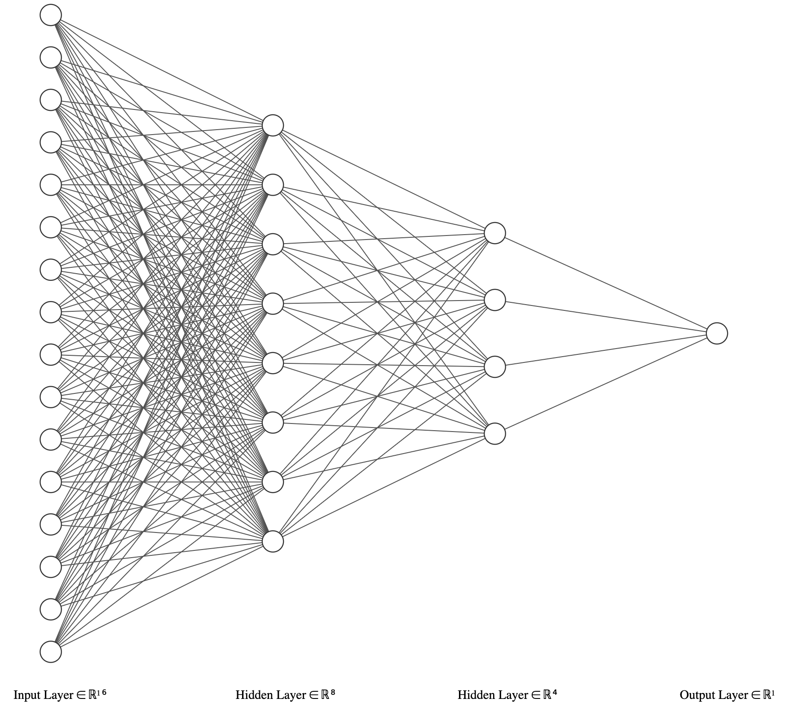

# Artificial Neural Network with scikit-learn

## Overview
 Scikit-Learn artificial neural network with 2 hidden layers implementation example. Hold out method has been applied with 0.2 test sample ratio.

## Neural Network Visualization


## Execution:
```
python3 neural_network.py
```

## Output:
```
Accuracy: 0.8203703703703704
Execution Time : 1.8231232166290283 seconds
Precision: 0.7889074716089868
F1 Score: 0.8043135342199302
Recall Score: 0.8203703703703704
```

## Dataset Reference: 

Mehmet Vurkac, Ph.D. (2019). UCI Machine Learning Repository [https://archive.ics.uci.edu/ml/datasets/Firm-Teacher_Clave-Direction_Classification]. Oregon Institute of Technology (current), Portland State University
